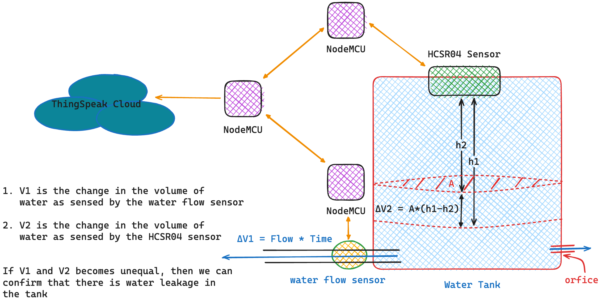
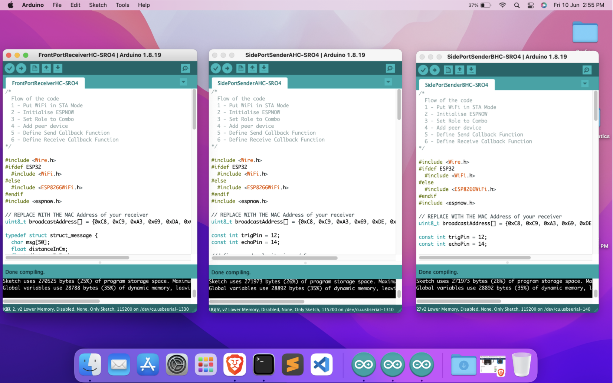
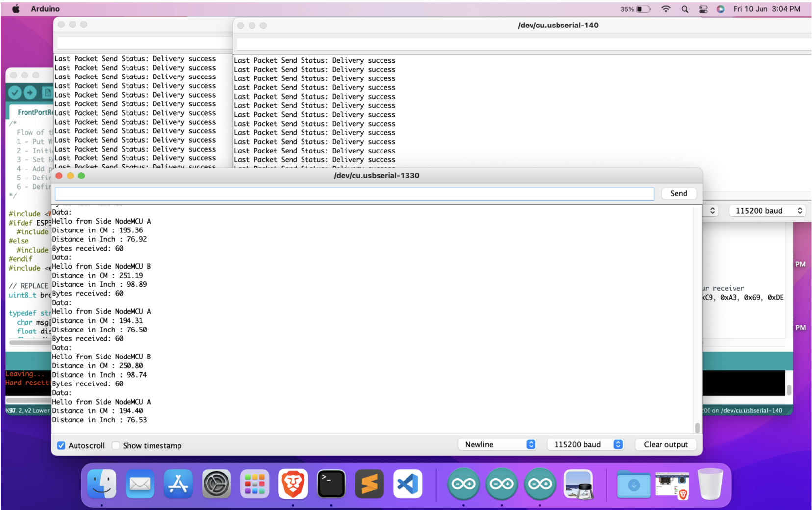
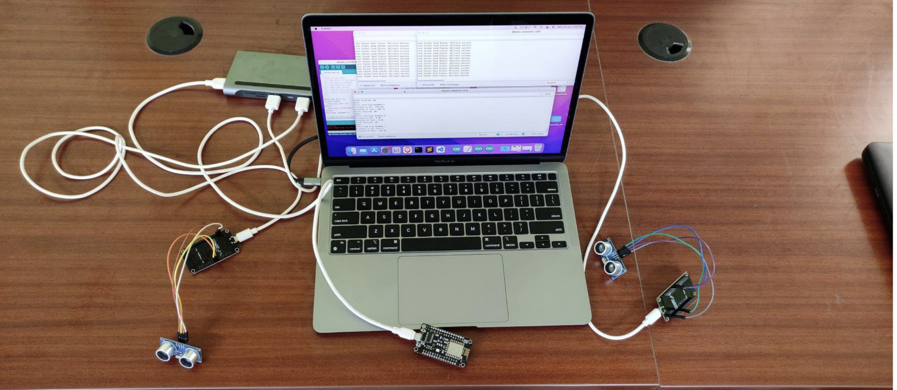
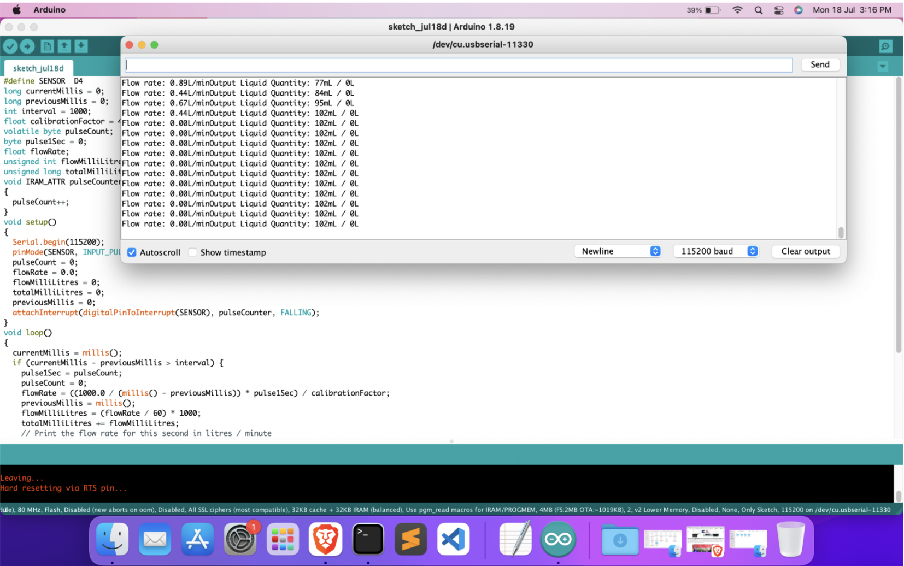
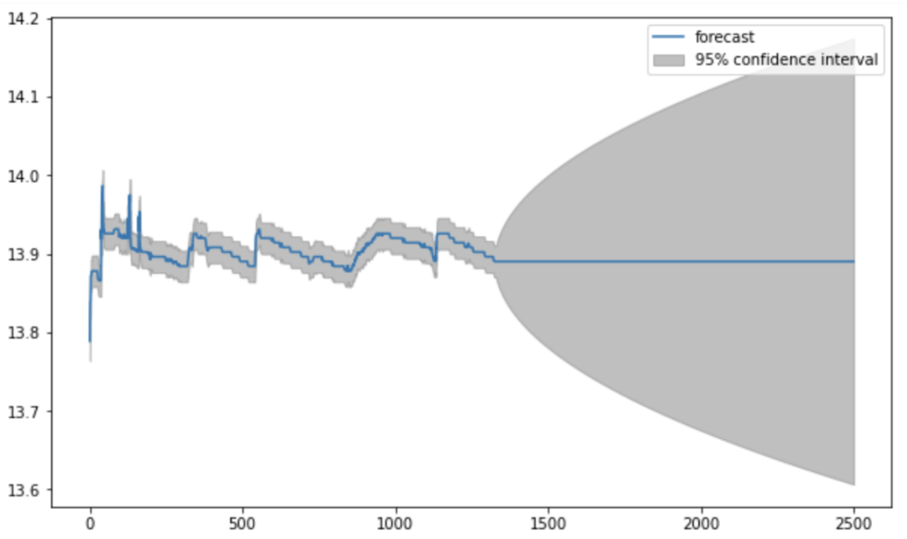
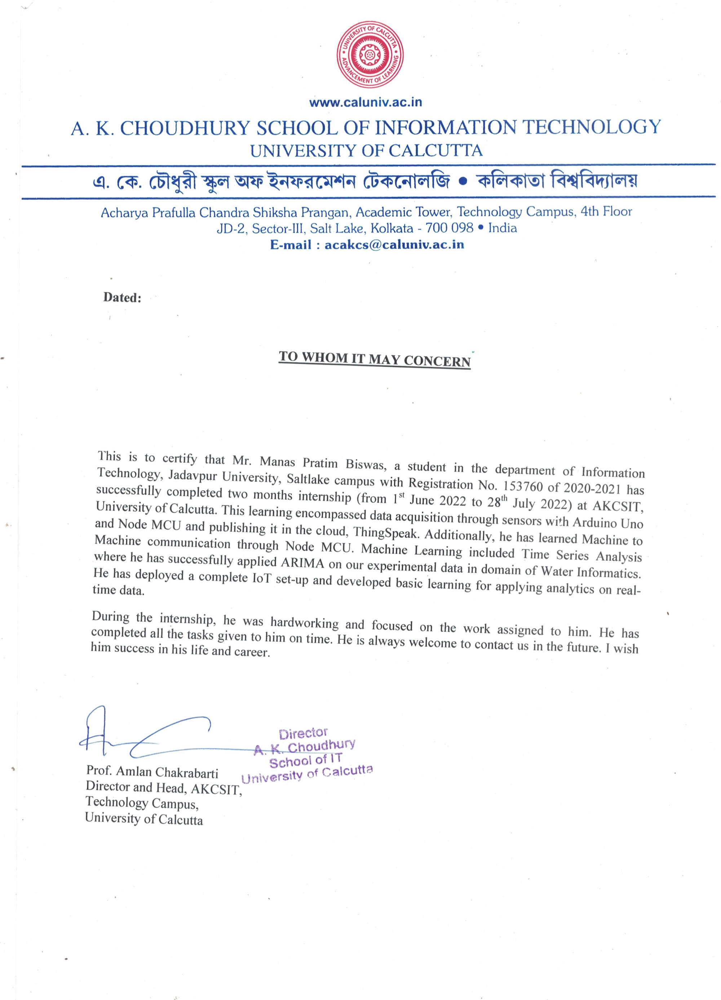

# Waterinformatics

## Overview

- Worked in the Water Informatics Laboratory, **_AKCSIT, University of Calcutta_ funded by the _Ministry of Jal Shakti, Government of India_**
- Designed IoT-based prototypes to detect water leakage and measure water parameters such as flow rate, pH, and turbidity in real-time using sensors and NodeMCU microcontrollers
- Multicasted the sensed data to the cloud for further Time-Series machine learning analysis with the _ARIMA_ model using Python

## Architecture

## Demonstrations

- Multicast Data Across multiple _NodeMCU_ to a single _NodeMCU_

- Cast the water sensor data to _ThingSpeak_ cloud platform

- Time-Series Forecasting

## Mentor

- [Amlan Chakrabarti](https://sites.google.com/caluniv.ac.in/amlanc-org)
- [Dola Bhattacharjee Gupta ](https://www.linkedin.com/in/dola-bhattacharjee-gupta-9a56173b)

## Certificate

